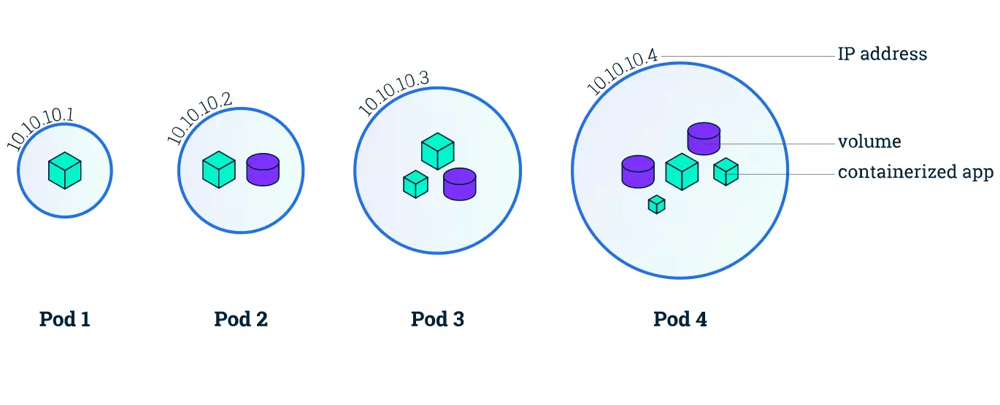
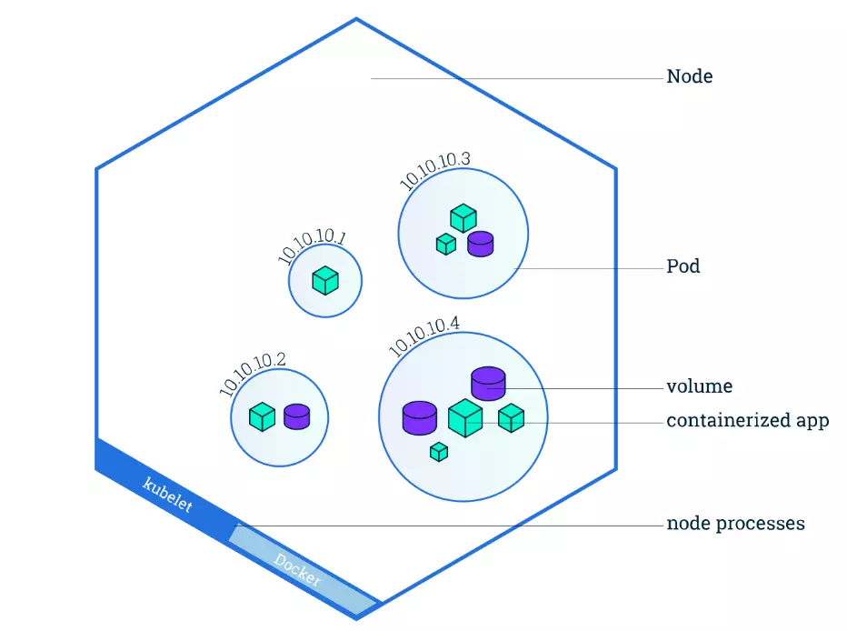

# What is Kubernetes?  How does it differ from Docker?

Kubernetes website ([https://kubernetes.io/](kubernetes.io)) explains that Kubernetes is an open source system for automating deployment, scaling, and management of containerized applications.

If Docker is the container for software, then Kubernetes is like the container manager.

## What does Kubernetes do?

At a basic level, Kubernetes manages containers. Say you have a sever that you want to load balance across several resources, Kubernetes can help manange those containers, monitor them, and even help heal or redeploy them as needed.

## Kuberentes Arcitecture

### Pods

Pods run container(s), so the Docker image that spun up our server on would go into a single pod. Multiple containers can be run in the same pod, and those containers will have shared memory. Pods have separate memory and IP addresses from other pods.

### Nodes/Kubelet

A Node manages several pods or application containers. The Node can run several pods on separate hosts and are isolated from each other by defualt.

### Clusters

Kubernetes clusters are composed of a Control Plane which manages the nodes in the cluster. The Control Plane schedules, scales, monitors, and updates applications that are running in the nodes.

## Deployments

Kubernetes instructions are defined in a manifest file written in yaml. This manifest is basicaly the configuration of the desired state, which Kubernetes then takes and manages its pods and images accordingly. Kubernetes takes the deployment file and works to create and maintain that

## Who made Kubernetes?

Kubernetes was originally created by several engineers at google and was released for open source shortly after its conception. It is currently trademarked by ([CNCF](https://www.cncf.io/)), the Cloud Native Computing Foundation. Their site has a bunch of other really cool software that I could write a curiosity report about

## Open Source Access/Development

The github link for Kubernetes is at ([github](https://github.com/kubernetes/kubernetes)) and its kinda insane. There are 134,141 commits on the main branch, 41.8k forks, 119k stars on the repo. It is written primarily in Go, a language that I could write up another curiosity report about. Go or Golang was also developed by Google and was developed with a goal to use concurrency while also not using C++. It seems that the developers were united in their dislike for C++ and wrote their own language to suit their needs.

## Skilled Kubernetes are in demand!

CNCF has a link for the state of jobs that use Kubernetes and claim that highly skilled Kubernetes programmers are the biggest barrier to entry for companies. They are in high demand, low supply, leading to higher salaries. An analysis of kubernetes job ([kube.careers](https://kube.careers/state-of-kubernetes-jobs-2025-q2)) shows that the Kubernetes jobs typically pay over 6 figures and 47% of those positions are Software Engineering and Dev Ops Engineer close behind it at 9.5%

It also shows that Docker is required for 60% jobs that require Kubernetes knowledge. This makes sense since Docker works well with Kubernetes.

## Connection to Dev Ops/329

We learned to spin up Docker Containers to run our server but aren't really managing the container directly. We have AWS ALB to manage traffic to the container images, ECS to monitor the containers health, Cloud Watch for console interface, but we don't manage the container directly. Rather than hoping that our containers do what we want, when we need them to, we could manage them through AWS Elastic Kubernetes Service ([EKS](https://www.google.com/url?sa=t&source=web&rct=j&opi=89978449&url=https://aws.amazon.com/eks/&ved=2ahUKEwjJ6vCW7o2RAxXgle4BHfzuLjkQFnoECCYQAQ&usg=AOvVaw2mMgWlGME4LaKDNCCZ8EeY))

Kubernetes offers a solution to managing containers, handling load balancing, self healing. If we continued with this project, Kubernetes would be a most likely next tool for managing our growing infrastucture at JWt-Pizza.
